**Name:** Julien Bourgeois

This report has two independent parts: a Fashion-MNIST MLP classifier, and English–French translation with Bahdanau attention.

---

## Part 1: Multilayer Perceptrons on Fashion-MNIST

This part trains a small neural net to classify a clothing thumbnail into one of ten categories.

### Task 1: Dataset and baseline model

Fashion-MNIST is a drop-in clothing version of MNIST. Every image is 28×28, grayscale, with one item roughly centered in the frame. The ten labels are T-shirt/top, Trouser, Pullover, Dress, Coat, Sandal, Shirt, Sneaker, Bag, and Ankle boot. There are 70,000 images. Torchvision downloads the official 60,000 / 10,000 train/test split. We hold out 10% of the official training set for validation, so the loaders we actually train on are 54,000 train / 6,000 val / 10,000 test. Pixel values are scaled to `[0, 1]`.

Those are the stats. This is what the pictures actually look like:

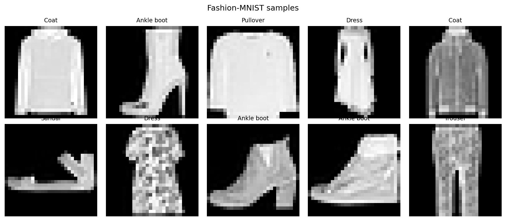

They are not sharp photos. They are pixelated catalog thumbnails. With the class name printed above an image, my brain fills in the rest — that is cheating. Cover the labels and it gets harder. Footwear still reads as shoes, and a heel is easy to tell from a sneaker. Coat versus pullover is hard. Dress versus coat is not that easy. Pants are not obvious either. If nobody had told me these were clothes, I could have talked myself into a different story. The model will not have that problem: it is only allowed to pick among those ten names.

That is the dataset: low-resolution clothes, ten names, and some pairs that still look alike even to a person.

The baseline model is a multilayer perceptron. A fully connected layer only takes a 1-D list of numbers, not a 2-D grid, so we flatten the 28×28 picture into 784 values first. The architecture is flatten → Linear(784 → 256) → ReLU → Linear(256 → 10) logits. Training used SGD (learning rate 0.1), `CrossEntropyLoss`, batch size 256, and 10 epochs. There is no softmax on the last layer: PyTorch's `CrossEntropyLoss` already applies it internally. This was not a pretrained model. Torchvision only downloaded the images; the MLP started from random weights.

After 10 epochs: train loss 0.380, val loss 0.375, val accuracy **0.868**.

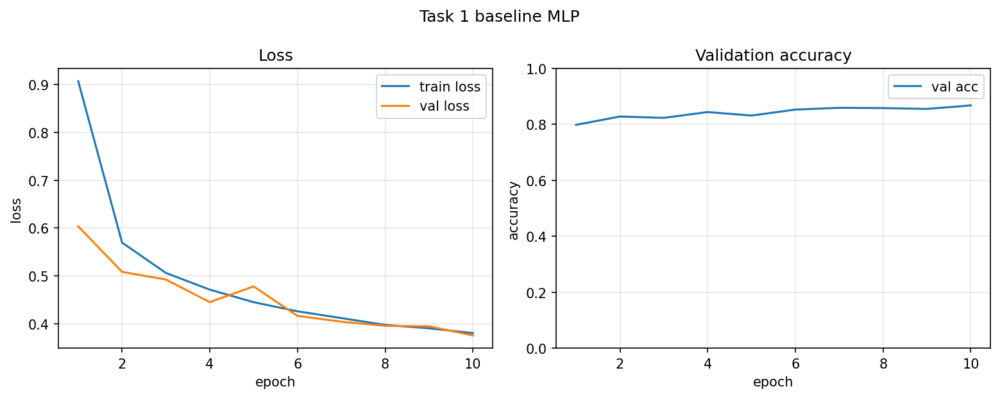

Val bounced instead of copying train. At epoch 5 it got worse (0.478) before coming back down. That one ugly epoch is not a diagnosis by itself: the val set is only 6,000 images, so the estimate is noisier than train, and learning rate 0.1 is aggressive. Over the full run val drifted toward train rather than pulling away. I do not read that as overfitting — val never ran off while train kept falling — and I do not read it as underfitting, because both losses came down and held-out accuracy improved.

87% matches what the pictures led me to expect. Footwear was already easy. The remaining mistakes should mostly be the lookalike tops — coat vs pullover, dress vs coat. Flattening also throws away the 2-D layout, so this net is not “looking at” a sleeve the way a person does; it is classifying a list of 784 pixel values. We already have 54,000 training images, so the limit here is more the model than the dataset size.

### Task 2: Hidden layers and model capacity

**Extra hidden layer** (`784 → 256 → 256 → 10`)

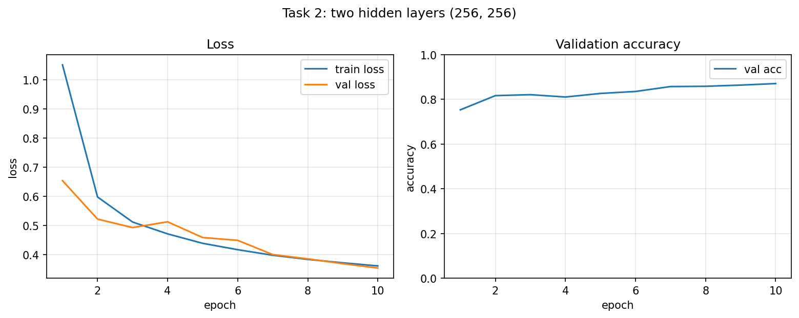

*TODO: compare this run to Task 1. Val accuracy landed around 0.871. Was the extra layer worth it, or basically a wash? Did the curves look any healthier?*

**One-neuron hidden layer** (`784 → 1 → 10`)

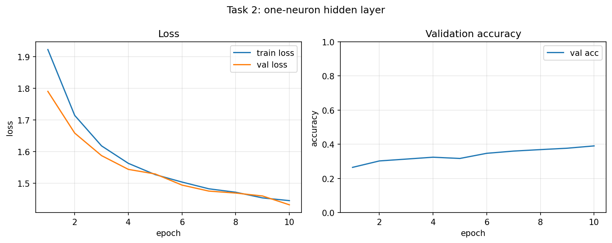

*TODO: val accuracy around 0.390. Everything after that layer only sees one number per image. Tie this back to Task 1: if coat vs pullover is already hard for a human looking at all 784 pixels, what happens when the net is forced to squash the whole picture into a single scalar?*

### Task 3: Activation functions and gradients

Same width `(256, 256)`, ReLU vs sigmoid.

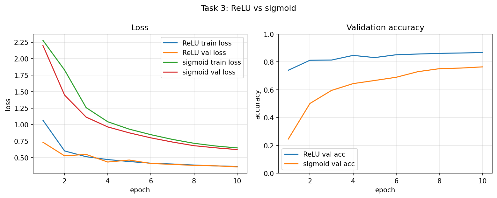

*TODO: compare final val accuracy and the shape of the curves. Starter numbers: ReLU about 0.868, sigmoid about 0.764 after 10 epochs.*

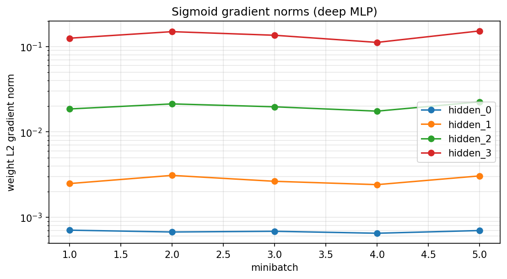

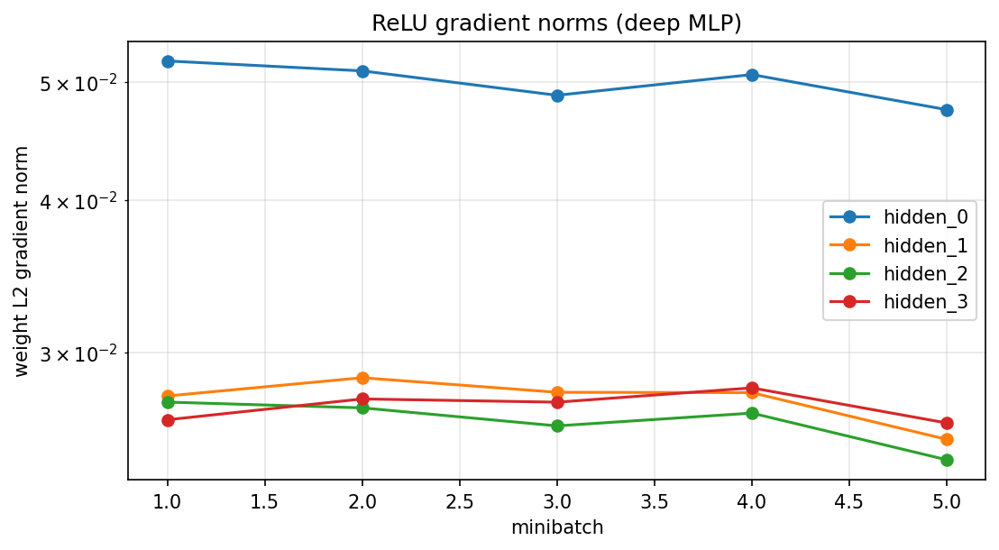

*TODO: vanishing gradients. Sigmoid saturates, so its derivative is near zero for large |x|. Those small factors multiply through a deep stack and starve the earliest layers. ReLU does not saturate on the positive side, so early-layer norms usually stay larger at the same depth.*

### Task 4: Computational considerations

*TODO: no extra plot. Cover, in your own words:*

- Parameters are stored in both training and prediction.
- Training also stores activations for backprop, parameter gradients, and optimizer state.
- Prediction can use `torch.no_grad()` and only needs weights plus the current layer's activations.
- Batch size, width, and depth all scale activation memory.
- These runs used MPS (Apple GPU) when available, otherwise CPU; the same memory accounting applies.

---

## Part 2: English–French translation with Bahdanau attention

*TODO: one short paragraph. Encoder–decoder GRU, additive (Bahdanau) attention, short English–French pairs, teacher forcing during training, greedy decode at test time.*

### Task 1: Train the attention model

| Setting | Hidden / embed size | Dropout | Learning rate | Train loss | Val loss | Val BLEU |
|---|---|---|---|---|---|---|
| A | 32 | 0.1 | 0.005 |  |  |  |
| B | 64 | 0.2 | 0.002 |  |  |  |

*TODO: fill the empty loss/BLEU cells from the notebook. Starter numbers from the run: A train 2.40 / val 2.71 / BLEU 0.240; B train 2.19 / val 2.52 / BLEU 0.256.*

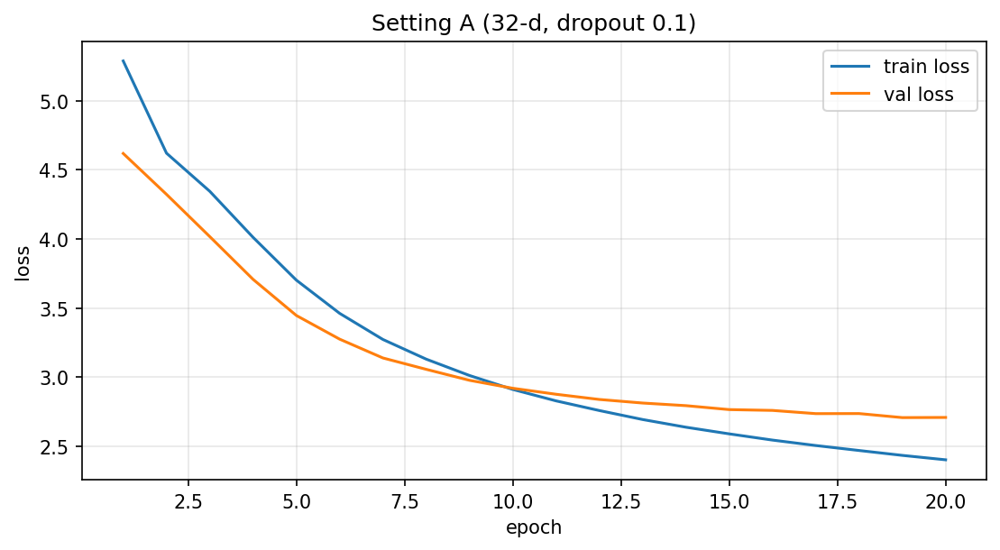

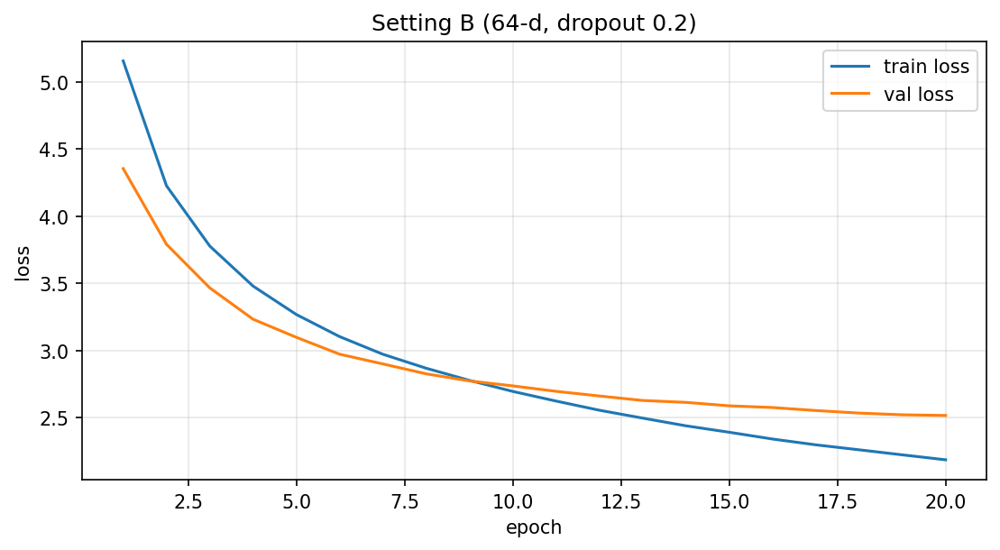

**What changed and what we observed**

*TODO: width, dropout, learning rate. BLEU on this tiny corpus is noisy; qualitative translations matter as much as the number.*

**Example translations**

| English | Reference | Setting A | Setting B |
|---|---|---|---|
|  |  |  |  |
|  |  |  |  |
|  |  |  |  |

*TODO: copy a few pairs from the notebook. Be honest about failures.*

### Task 2: Visualize and interpret attention

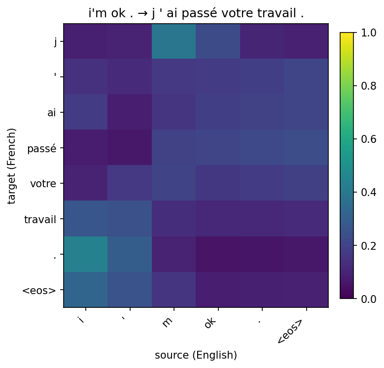

*TODO: what does each generated French token attend to? Is this helpful or unsuccessful?*

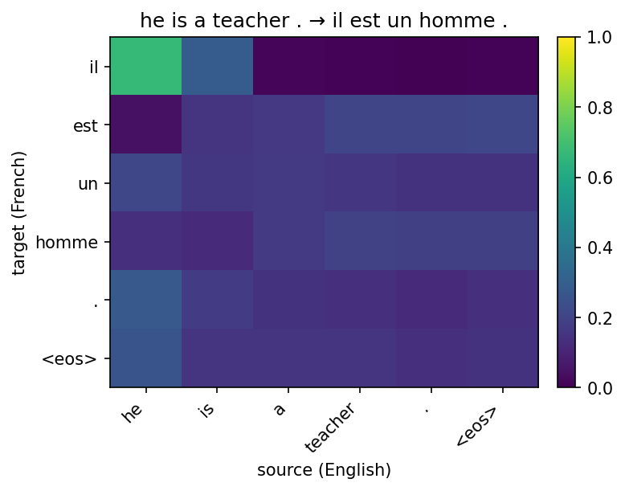

*TODO: look for a helpful pattern (a noun attending to its English counterpart, or a roughly diagonal alignment).*

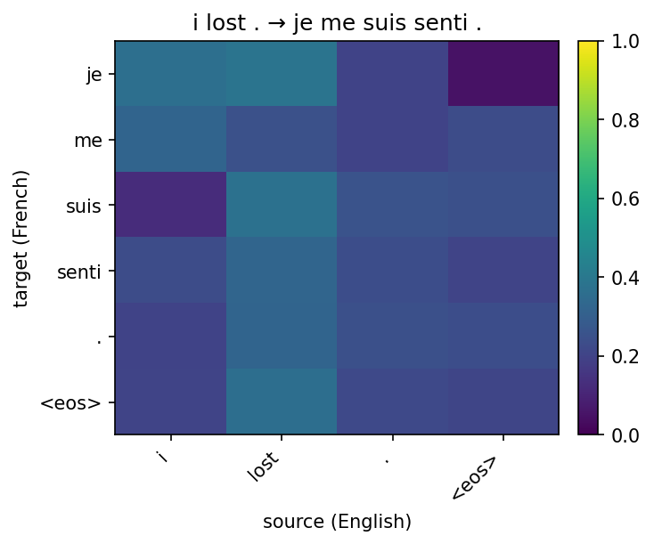

*TODO: look for an unsuccessful pattern (mass on `<eos>` / pad, ignored source tokens, repeated generation, off-by-one).*

**Helpful example:** *TODO: which heatmap, and why.*

**Unsuccessful example:** *TODO: which heatmap, and why.*
